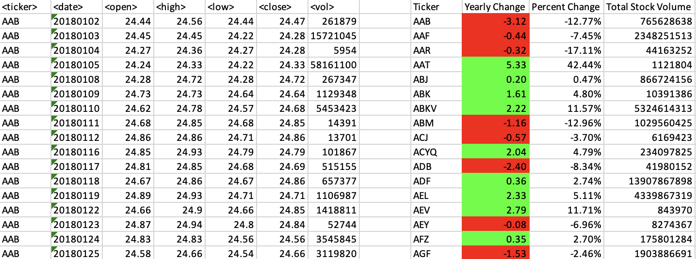
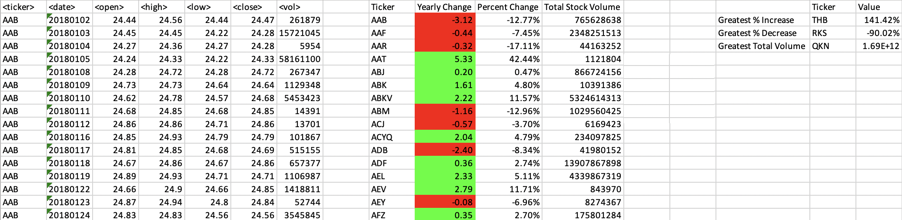

## Stock Analysis Script

This script is designed to analyze stock data for a given year. It loops through all the stocks for the specified year and provides the following information:

- Ticker Symbol: The stock's ticker symbol.
- Yearly Change: The difference between the opening price at the beginning of the year and the closing price at the end of the year.
- Percentage Change: The percentage change in the stock price from the opening price to the closing price.
- Total Stock Volume: The total volume of the stock traded throughout the year.

### Moderate Solution

In addition to the basic analysis, the script includes functionality to find the stock with the "Greatest % Increase," "Greatest % Decrease," and "Greatest Total Volume." This allows you to identify stocks with notable performance indicators. The output of this solution matches the provided image.

### Hard Solution

To further enhance the script, the necessary adjustments have been made to enable it to run on every worksheet (i.e., every year) at once. This means you can analyze multiple years of stock data simultaneously. This solution saves time and provides a comprehensive overview of stock performance across different years.

Please refer to the script for implementation details.
